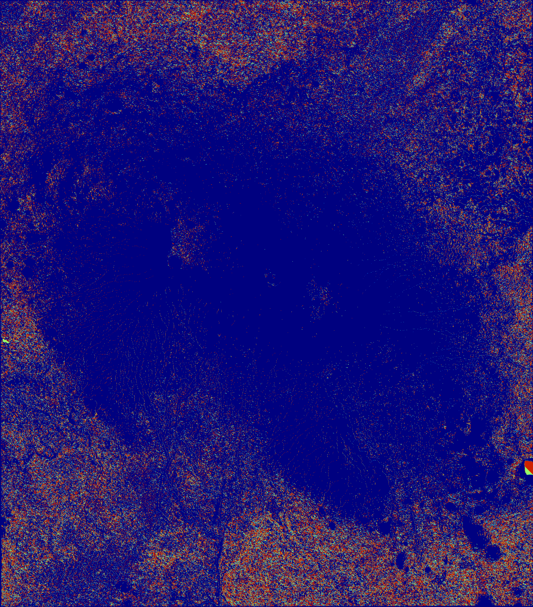
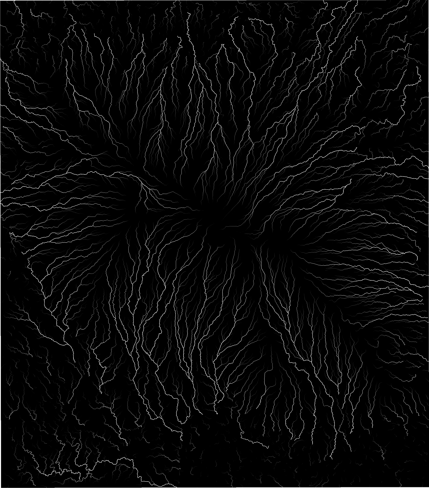
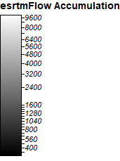
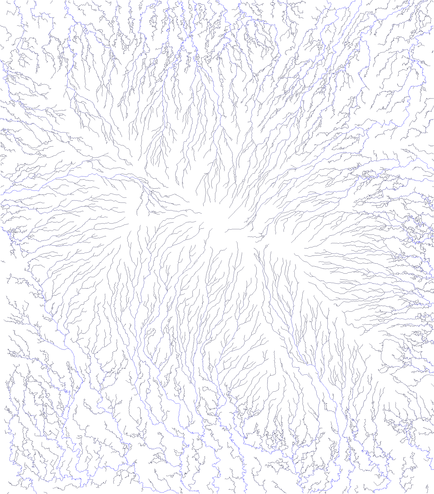
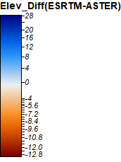
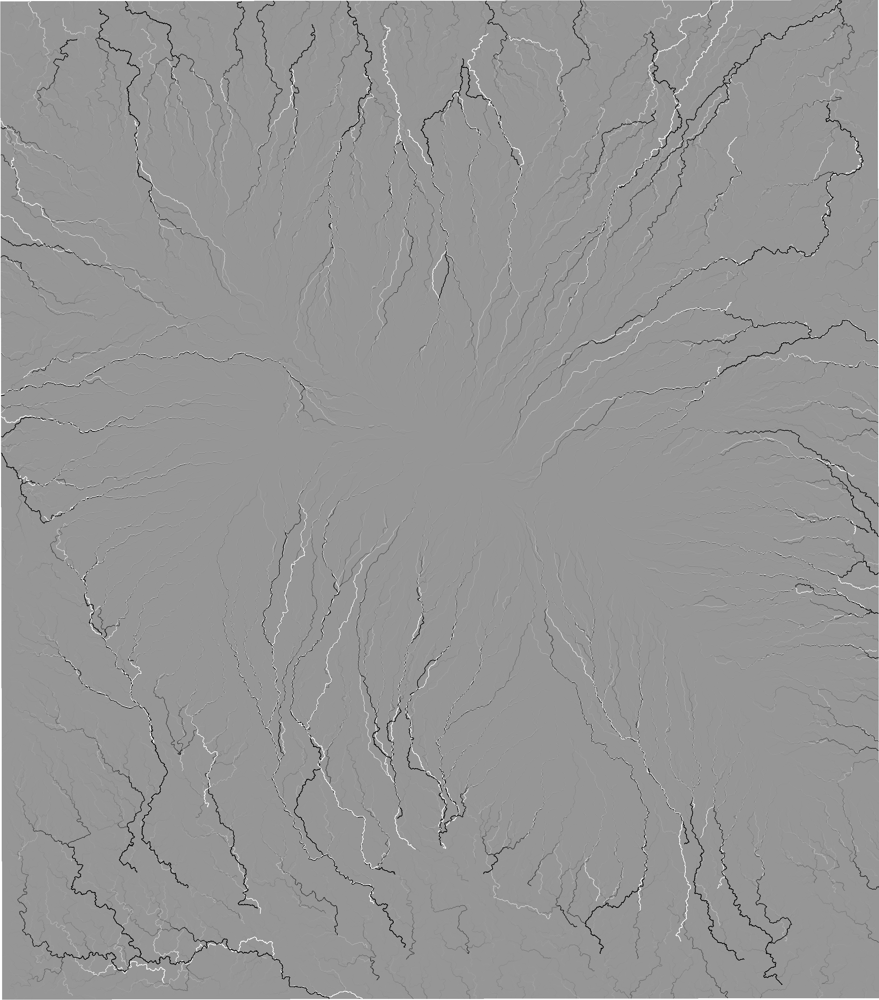
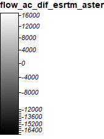

### Week 4 Hydrological Analysis with Aster and SRTM

In this lab, I preformed a hydrological analysis of Mount Kilimanjaro with both Aster and SRTM data. The hydrological analysis was preformed with these two data types in order to compare the two results and find the preferable data source for this use. 

To preform my data analysis, I created a batch script that would automate the hydrological analysis process in SAGA 6.2. To start the analysis I created a mosaick of two DEMs: ASTGTMV003_S03E037_dem.sgrd and ASTGTMV003_S04E037_dem.sgrd for ASTER data; S04E037_elevation.sgrd;S03E037_elevation.sgrd for ESRTM data. This data can be found and was downloaded from the [Earth Data Search](https://earthdata.nasa.gov/) website. WHen downloading ESRTM elevation data, the files come as .hgt files which cannot be analyzed in SAGA. To create these ESRTM .sgrd files (elevation files) that SAGA can read, I first opened up the S04E37.hgt and S03E037.hgr files in SAGA and them saved them as the .sgrd files mentioned above. 

Here are the command lines I used to implement this first step with ESRTM data (these lines are modified from the materials provided in Middlebury College's Open Source GIScience class):

```::set the path to your SAGA program
SET PATH=%PATH%;c:\saga6

::set the prefix to use for all names and outputs
SET pre=ESRTML4

::set the directory in which you want to save ouputs. In the example below, part of the directory name is the prefix you entered above
SET od=W:\lab4\%pre%analysis

:: the following creates the output directory if it doesn't exist already
if not exist %od% mkdir %od%

:: Run Mosaicking tool, with consideration for the input GRIDS, OVERLAP - maximum (3), RESAMPLING - bilinear interpolation (1), and output TARGET_USER_OUT_GRID
saga_cmd grid_tools 3 -GRIDS=S04E037_elevation.sgrd;S03E037_elevation.sgrd -NAME=%pre%mosaic.sgrd -TYPE=9 -RESAMPLING=1 -OVERLAP=3 -MATCH=0 -TARGET_OUT_GRID=%od%\%pre%mosaic.sgrd -TARGET_DEFINITION=0 -TARGET_USER_SIZE=0.000278 -TARGET_USER_XMIN=37.000277 -TARGET_USER_XMAX=37.700000 -TARGET_USER_YMIN=-3.499723 -TARGET_USER_YMAX=-2.700000 -TARGET_USER_FITS=0
```

Generates:
 

To use this script with ASTER data, simply change the prefixes to indicate that the outputs will be ASTER files, and within the mosaicking tool change the Grids inputs to the ASTER files you want to mosaick. Here I defined the mosaick to make a 'cropped' DEM of the area right around Mount Kilimanjaro. This is a step I added in later because the Mosaicking tool did not create exactly the same grid systems for the ASTER and ESRTM data, which did not allow the ASTER DEMs (and the analysis grids created based off of these DEMs) to be compared to the ESRTM DEMs (and the analysis grids based off of these DEMs). This way, I could ensure that the grids I was creating were being created using the same grid system.

Next, I converted the mosaic.sgrd files to UTM projection zone 37S and created a hillshade model. Here are those command lines:

```
:: Run UTM Projection tool
saga_cmd pj_proj4 24 -SOURCE=%od%\%pre%mosaic.sgrd -RESAMPLING=1 -KEEP_TYPE=1 -GRID=%od%\%pre%mosaicUTM.sgrd -UTM_ZONE=37 -UTM_SOUTH=1

::Run Hillshade
saga_cmd ta_lighting 0 -ELEVATION=%od%\%pre%mosaicUTM.sgrd -SHADE=%od%\%pre%hillshade.sgrd -METHOD=0 -POSITION=0 -AZIMUTH=315.000000 -DECLINATION=45.000000 -EXAGGERATION=1.000000 -UNIT=0
```

To generate the classic greyscale hillshade image, you will have to adjust the color options within SAGA. 

Next I began the flow analysis, starting by calling the Sink Drainage Route Detection tool to identify sinks and the Sink Removal tool to remove the sinks. The input for both commands is the mosaicked UTM adjusted DEM, and the Sink Removal requires the additional sinkroute.srg that is the output (-SINKROUTE) of the Sink Drainage Route Detection. Sink removal's output is -DEM_PREPROC.

```
::Run Sink Drainage Route Detection
saga_cmd ta_preprocessor 1 -ELEVATION=%od%\%pre%mosaicUTM.sgrd -SINKROUTE=%od%\%pre%sinkroute.sgrd -THRESHOLD=0 -THRSHEIGHT=100.000000

::Run Sink Removal
saga_cmd ta_preprocessor 2 -DEM=%od%\%pre%mosaicUTM.sgrd -SINKROUTE=%od%\%pre%sinkroute.sgrd -DEM_PREPROC=%od%\%pre%sinkfill.sgrd -METHOD=1 -THRESHOLD=0 -THRSHEIGHT=100.000000
```

The sink Drainage Route Detection creates the grid shown below in SAGA, and the DEM created by the sink removal should look very similar to the original mosaicUTM.sgrd.
 

The final element of the batch script was to apply the anlysis tools Flow Accumulation and Channel Network. Flow Accumulation (top down) creates pathways through which water will accumulate based off of the sinkfill.srg DEM and the sinkroute.srgd grid. Channel Network will use the sinkfill.sgrd as the elevation dem, sinkroute.sgrd, and the flowaccumulation.sgrd to create a channel network.

```
::Run Flow Accumulation
saga_cmd ta_hydrology 0 -ELEVATION=%od%\%pre%sinkfill.sgrd -SINKROUTE=%od%\%pre%sinkroute.sgrd -WEIGHTS=NULL -FLOW=%od%\%pre%flowaccumulation.sgrd -VAL_INPUT=NULL -ACCU_MATERIAL=NULL -STEP=1 -FLOW_UNIT=0 -FLOW_LENGTH=NULL -LINEAR_VAL=NULL -LINEAR_DIR=NULL -METHOD=4 -LINEAR_DO=1 -LINEAR_MIN=500 -CONVERGENCE=1.100000

::Run Channel Network
saga_cmd ta_channels 0 -ELEVATION=%od%\%pre%sinkfill.sgrd -SINKROUTE=%od%\%pre%sinkroute.sgrd -CHNLNTWRK=%od%\%pre%chnlntwrk.sgrd -CHNLROUTE=%od%\%pre%chnlroute.sgrd -SHAPES=%od%\%pre%chnlshapes.sgrd -INIT_GRID=%od%\%pre%flowaccumulation.sgrd -INIT_METHOD=2 -INIT_VALUE=1000.000000 -DIV_GRID=NULL -DIV_CELLS=5 -TRACE_WEIGHT=NULL -MINLEN=10

::print a completion message so that uneasy users feel confident that the batch script has finished!
ECHO Processing Complete!
PAUSE
```
Flow accumulation output for ESRTM input data (I palyed with the colors, mode (logarithmic up) and stretch factor, value range, and resampling (bilinear interpolation) on these to make them look this way):

 

Channel Network output for ESRTM input data:
 

### Here are the full batch scripts I created using [ESRTM data](ESRTML4_analysis.bat) and [ASTER data](ASTERL4_analysis.bat).

## ESRTM vs ASTER for Flow Analysis

The next step of this analysis was to compare the ESRTM input data flow anlysis to the ASTER input data flow analysis. To do this I used the Grid Difference tool (Grid --> Calculus --> Grid Difference) to find the difference between the elevation data and Flow Accumulation for ESRTM and ASTER (subtract the ASTER4LmosaicUTM.sgrd frpm ESRTM4LmosaicUTM.sgrd and ESRTML4flowaccumulation.sgrd from ASTERL4flowaccumulation.sgrd).

Elevation difference:

 

Flow Accumulation difference:

 

